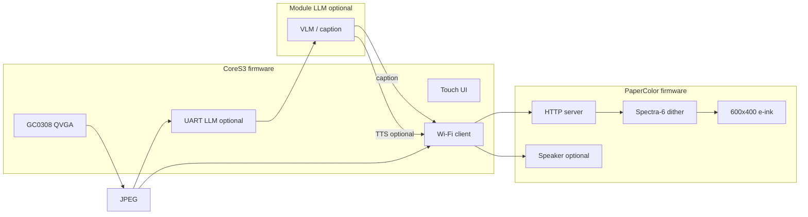

# Architecture

## System overview

## Why two projects

| | CoreS3 | PaperColor |
|---|--------|------------|
| **Framework** | Arduino / PlatformIO | ESP-IDF 5.5 |
| **Why** | Camera + `M5ModuleLLM` + touch UI are mature in Arduino | Factory firmware is ESP-IDF; M5PM1 + Spectra-6 tuned for IDF |
| **Binary** | `cores3/.pio/build/M5CoreS3/firmware.bin` | `papercolor/build/paper_color.bin` |

Shared logic is the **wire protocol** (`shared/protocol/`), not a single binary.

## Data path (v1)

1. User double-taps CoreS3 screen.
2. `frame2jpg(quality 40)` → ~15–40 KB.
3. (Optional) UART → Module LLM VLM → caption.
4. `POST /api/v1/photo` to PaperColor with JPEG body + JSON metadata.
5. PaperColor dithers to 6 inks, full refresh (~15–20 s).

UART carries **LLM traffic only** — not the JPEG to PaperColor.

## Constraints

| Topic | Detail |
|-------|--------|
| Camera | 0.3 MP, QVGA practical max |
| E-ink | 6 colors, full refresh only, no touch |
| Wi-Fi | 2.4 GHz only |
| LLM | AX630C Linux module, 115200 serial, apt-installed models |

See also [M5Stack hardware docs](m5stack/README.md) and [vendor reference](../vendor/README.md).
